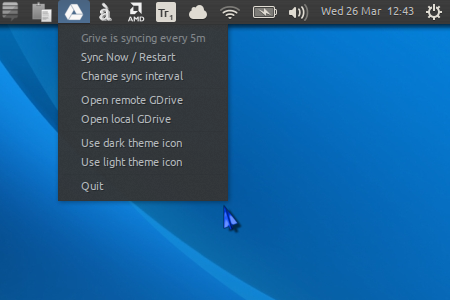

Notice
===============
I've decided to stop working on this project because (1) development of grive has stopped some time ago, and (2) I've become convinced that ocamlfuse solution represents a better alternative (although without an indicator for now)

**Further info:** https://github.com/astrada/google-drive-ocamlfuse & http://www.webupd8.org/2013/09/mount-google-drive-in-linux-with-google.html

Further Notice
===============
I've later found another git repository that may be considered as a good alternative to the obsolete grive project, and also wrote a similar indicator for it, which was also suspended after finding a fully functional Google Drive Indicator for Linux. 

**Further info:** https://github.com/Sadi58/indicator-drive

grive-indicator
===============

A very simple and lightweight indicator applet to synchronize with Google Drive using grive.

Based on the AMD indicator applet here: https://github.com/beidl/amd-indicator

Prerequisites
===============

1. Install "grive", "python-appindicator" and "zenity" (e.g. using using DEB package or "setup-1-grive-indicator" script as below), AND
2. If using for the first time, have "grive" authenticated with your chosen Google account by (creating and) changing directory (cd) to "~/Google Drive" and then entering the terminal command "grive -a" in that directory (e.g. using "setup-2-grive" script as below).

Installation
===============
1. Extract and install the DEB file in the archive with "gdebi-gtk" application, and then make sure that Prerequisite 2 as above is met, if using this indicator for the first time, OR
2. Make first "setup-1-grive-indicator" and then "setup-2-grive" script files executable and run in terminal in that order.

The "grive-indicator" should now be listed among startup applications and ready to start on next login.

Caution: In case of non-DEB installation, be aware that copying a file under system directory "/etc/sudoers.d" might make it impossible to use the "sudo" command if there's something wrong with the file. Therefore, it might be a good idea to keep this folder open in a Root Nautilus or Terminal window so that you can remove this file to remedy such a problem. It might also be safer to extract and copy at least that file from the DEB package.

Tests
===============
Successfully tested under: Ubuntu 13.10 (Unity), Linux Mint 16 (Cinnamon), Siduction 13.2 (Xfce), Debian Gnome Shell

ToDo
===============

1. Add a list of recently changed items (e.g. using a command like: inotifywait -r -e modify,attrib,moved_to,moved_from,move_self,create,delete,delete_self "$HOME/Google Drive")
2. Create a simple GUI for "grive" initial setup (attempts to include "setup-2-grive" script in DEB package under "postinst" failed).

Changelog
===============

0.98: Changed "set sync interval" method, menu position and info, and desktop filename
0.97: Added "Sync Now / Restart" menu item
0.96: Fixed and enhanced INFO menu item to show Grive sync interval
